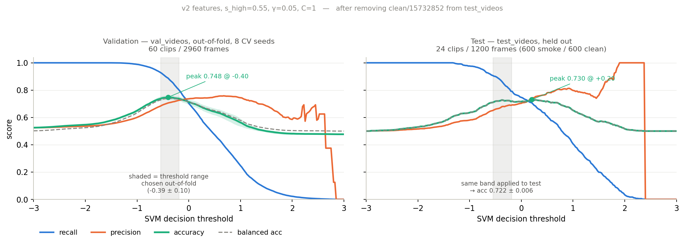
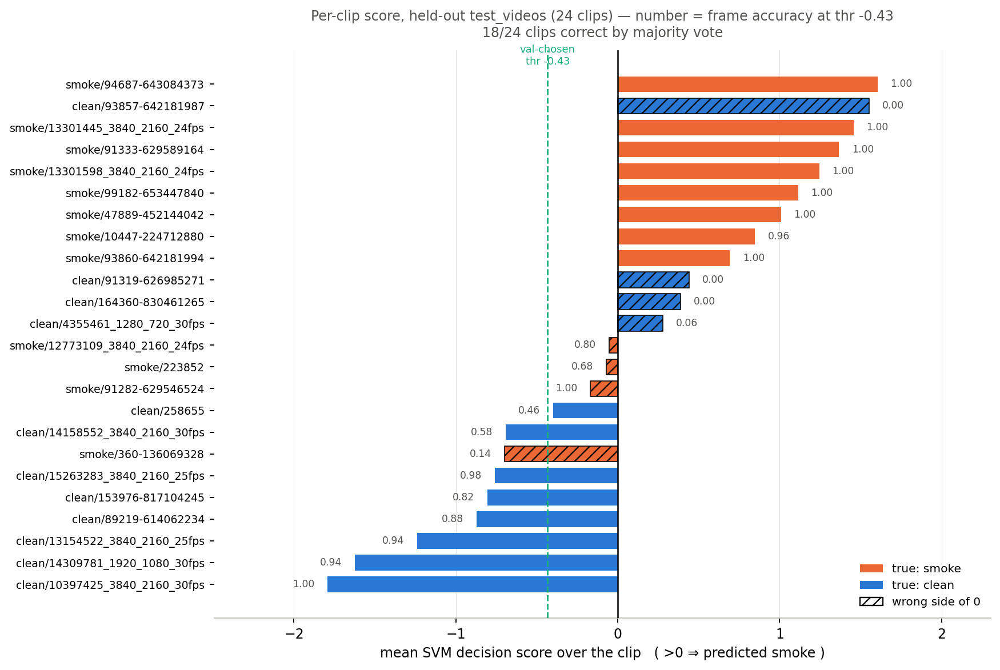

# Video smoke detection (Appana et al. 2017) — Python port

Python reimplementation of:

> Appana, Dileep K., et al. *"A video-based smoke detection using smoke flow
> pattern and spatial-temporal energy analyses for alarm systems."*
> Information Sciences 418–419 (2017): 91–101.

Pipeline per frame pair:

```
frame ─▶ HSV colour mask ─▶ temporal frame diff (n=1)
      ─▶ Gabor bank (5 orientations) ─▶ entropy/uniformity/mean/std  (20)
      ─▶ single-level 2-D wavelet energy                            ( 1)
      ─▶ 21-D vector ─▶ RBF-SVM ─▶ smoke / no-smoke
```

HSV thresholds + morphology follow the authors' own MATLAB
([`color_masking.m`](https://github.com/raady07/Smoke-Detection-in-video));
the Gabor bank follows their `gaborFilterBank.m` (the Haghighat form actually
used in the published code, not the simplified Eq. 3 in the text). The repo
only ships masking + the bank + an SVM driver that loads pre-computed `.mat`
features, so the per-frame extractor here is reconstructed from the paper and
pinned to the repo wherever they disagree.

## Files
- `smoke_features.py` — Qt-free core: mask, diff, Gabor bank, stats, wavelet, 21-D vector.
- `smoke_features_v2.py` — revised 28-D feature stage (see [Results](#results)).
- `smoke_detection.py` — dataset loader, RBF-SVM wrapper, `train`/`eval`/`predict` CLI.
- `smoke_viz.py`       — stage-panel visualiser (mask / diff / 5 Gabor / wavelet + verdict).
- `requirements.txt`, `README.md`.
- `optimization/` — everything used to tune and measure the system. Not needed to
  train or run it; see [`optimization/README.md`](optimization/README.md).

## Install
```bash
pip install -r requirements.txt
```

## Dataset layout
One sub-folder per class (matches `val_videos/`):
```
val_videos/
  smoke/  *.mp4     # smoke present      -> 1
  both/   *.mp4     # smoke present      -> 1
  clean/  *.mp4     # no smoke           -> 0
  fire/   *.mp4     # flame-only         -> 0   (see note)
```
**Label note:** this is a *smoke* detector, so `fire` defaults to **non-smoke**.
If your `fire` clips contain visible smoke, move `"fire"` into `SMOKE_LABELS`
at the top of `smoke_detection.py` (one line).

## Use

A trained model ships as **`smoke_v2.joblib`** (28-D v2 features, γ=0.05, C=1,
threshold −0.43, `s_high=0.55`). It scores 0.718 frame / 0.750 video on
held-out `test_videos` — see [Results](#results).

```powershell
# run on one clip (stride, threshold and feature stage all come from the model)
python smoke_detection.py predict --video clip.mp4 --model smoke_v2.joblib --out annotated.mp4

# evaluate a labelled set (per-frame + per-video)
python smoke_detection.py eval --data ..\test_videos --model smoke_v2.joblib --stride 5 --max-frames 50

# retrain from scratch
python smoke_detection.py train --data ..\val_videos --out smoke_v2.joblib `
  --cv 5 --stride 5 --iir iir-auto --max-frames 50 --grid --auto-threshold

# visualise every pipeline stage
python smoke_viz.py frame   --video clip.mp4 --model smoke_v2.joblib --at 4 --out panel.png
python smoke_viz.py montage --video clip.mp4 --model smoke_v2.joblib --out viz.mp4
```

Three things to know:

- **`--grid` matters.** Without it training falls back to `--sigma 0.6`
  (the paper value → γ=1.389), which on standardised features is ~29× too wide
  and memorises. `--auto-threshold` stores an out-of-fold threshold in the model.
- **`eval` needs `--stride` and `--max-frames` repeated** — they default to 1 and
  unlimited, and a different stride changes the temporal-diff gap. `--iir` and
  `--features` are read back from the model automatically.
- **`--features v1|v2`** selects the feature stage, default `v2`. Models saved
  before this option load as `v1` and keep working unchanged.

Useful flags (train): `--sigma 0.6` (RBF σ, paper value → γ=1/(2σ²)), `--C`,
`--stride N` (temporal gap n / speed lever), `--resize 320x240|none`,
`--gabor haghighat|paper`, `--max-frames N`. `predict` takes `--stride` too
(defaults to whatever the model was trained with, so the diff gap matches).

## IIR background mode (optional, replaces the frame diff)

By default the temporal difference is the paper's adjacent-frame diff
`|I(t) - I(t-1)|`. The `--iir` flag replaces it with a difference against an
IIR background model `B`:

```
diff = |I(t) - B(t)|,   B(t+1) = (1-α)·B(t) + α·I(t)
```

- `--iir frame`     — paper default (adjacent frame diff), stateless.
- `--iir iir`       — fixed-alpha background (`--iir-alpha`, default 0.05).
  Slow drifting smoke stays visible in the diff for many frames instead of
  vanishing when its frame-to-frame change is tiny.
- `--iir iir-auto`  — alpha adapts per frame to the scene's apparent speed
  (median |dI/dt| / |∇I| on a blurred half-res copy, EMA-smoothed), the same
  logic as the MHT pipeline's Stage-1 auto mode: static scenes get a long
  memory (α→0.01), fast global motion updates quickly (α→0.25) so camera/wind
  movement does not flood the features.

```bash
# train with the adaptive background
python smoke_detection.py train --data val_videos --out smoke_iir.joblib        --cv 5 --stride 5 --iir iir-auto
```

The chosen mode is stored inside the model config, so `eval` and `predict`
automatically reproduce the training-time diff — no flag needed at inference.
One `IIRBackground` instance is created per video and reset between clips.
Models trained before this option default to `frame` and keep working
unchanged. The mode changes the feature distribution, so never mix: a model
must be trained and evaluated with the same diff mode (the stored config
guarantees this unless you override it by hand). Programmatic use:
`make_iir(cfg)` → pass as `frame_pair_features(..., iir=iir)`.

Grouped CV splits by *video*, so frames from one clip never sit in both train
and test — accuracy is honest, unlike a plain frame shuffle.

## Performance — Gabor is FFT-backed by default
The Gabor stage is ~93% of the per-frame cost. `SmokeConfig.gabor_backend="fft"`
(default) FFTs the diff image once, multiplies by pre-computed kernel spectra,
and inverse-FFTs all 5 orientations in one batched call → O(n log n), kernel
size irrelevant. The image is reflect-padded so the interior is **bit-identical**
(~1e-15) to direct convolution, so a model trained on either backend is
interchangeable — no retrain.

```
Gabor stage:   216 ms  →  17 ms      (~13x)
full per-pair: ~200 ms  →  ~30 ms     (~7x end-to-end on a typical CPU)
```
Set `gabor_backend="spatial"` to fall back to the original 5× `cv2.filter2D`.
Other speed levers: `--stride` (fewer frames), `--resize` (fewer pixels).
Rough wall-clock: `T ≈ (total frame-pairs) × ~0.03 s`.

## WildGuard hook
`frame_pair_features(prev_bgr, cur_bgr, bank, cfg)` returns the 21-D vector and
has no Qt/I/O deps, so it slots in as a cascade stage. `return_debug=True` also
hands back mask / diff / per-orientation Gabor responses for a GUI overlay, and
`smoke_viz.make_debug_panel(...)` composes them into a panel (palette matches
`wildfire_gui.py`):

```python
from smoke_features import SmokeConfig, build_gabor_bank, frame_pair_features
cfg  = SmokeConfig()                 # gabor_backend="fft" by default
bank = build_gabor_bank(cfg)         # GaborBank: call bank.responses(diff)
vec, dbg = frame_pair_features(prev, cur, bank, cfg, return_debug=True)
# dbg: {"masked_cur", "diff", "responses"}
```

## Results

All numbers are on **held-out clips** — trained on `val_videos`, evaluated on
`test_videos`, video-grouped so no clip appears in both. Full derivation in
[`FINDINGS_gabor_baseline.md`](optimization/FINDINGS_gabor_baseline.md).

| stage | frame acc | video acc | recall | precision |
|---|---|---|---|---|
| paper baseline (σ=0.6, 21-D, paper mask) | 0.606 | 0.583 | 0.415 | 0.671 |
| + RBF γ fixed | 0.638 | 0.625 | 0.430 | 0.737 |
| + v2 28-D features | 0.704 | 0.750 | 0.773 | 0.679 |
| + HSV mask retuned (`s_high` 0.28→0.55) | **0.718** | **0.750** | **0.882** | 0.665 |

Pooled video-grouped CV over all 84 clips (5 seeds, lower variance than the
24-clip test set): **0.721 ± 0.011** frame, **0.748 ± 0.020** video.

Threshold selected honestly out-of-fold on `val_videos` transfers well:
test accuracy **0.722 ± 0.006** across 8 CV seeds, against a best-possible
0.730 — only 0.008 of selection optimism.

### Threshold trade-off — validation vs test



Left: out-of-fold on `val_videos` (what you can see while developing, averaged
over 8 CV seeds, band = ±1 sd). Right: held-out `test_videos` (what you get).
Same model, same axes.

| | validation (OOF) | test | gap |
|---|---|---|---|
| peak accuracy | 0.748 | 0.730 | −0.018 |
| ...at threshold | −0.40 | +0.19 | 0.59 |
| precision ceiling | 0.758 | 1.000 | +0.242 |
| accuracy at the val-chosen threshold | — | 0.722 ± 0.006 | — |

The two curves now agree closely on accuracy (0.018 apart), and the val-chosen
threshold band transfers almost losslessly — **0.722 ± 0.006** on test versus a
best-possible 0.730.

The peak locations still sit ~0.6 apart, so precision/recall *balance* does not
transfer even though accuracy does. Tune the threshold on validation if you care
about accuracy; do not trust a validation precision target.

Operating points on the 24-clip test set:

| threshold | acc | bal | recall | precision | FP | FN | video |
|---|---|---|---|---|---|---|---|
| −0.49 (max f1) | 0.721 | 0.721 | 0.897 | 0.663 | 273 | 62 | 0.750 |
| **−0.43 (val-chosen)** | **0.718** | 0.718 | **0.882** | 0.665 | 267 | 71 | **0.750** |
| 0.00 | 0.716 | 0.716 | 0.747 | 0.703 | 189 | 152 | 0.708 |
| +0.19 (max acc) | 0.730 | 0.730 | 0.708 | 0.740 | 149 | 175 | 0.708 |

Accuracy peaks at **0.720 around thr ≈ +0.30** and the peak is broad, so the
exact value is not critical. The important shape is the precision ceiling:
**precision never exceeds 0.740**, and reaching even that requires pushing the
threshold to +0.87, where recall has fallen to 0.552. Precision ≥ 0.75 is
unreachable at *any* threshold — a property of the features, not something a
threshold can fix.

| threshold | acc | bal | recall | precision | FP | FN | video |
|---|---|---|---|---|---|---|---|
| −0.71 (max f1) | 0.706 | 0.716 | 0.953 | 0.628 | 339 | 28 | 0.760 |
| −0.23 (val-chosen) | 0.680 | 0.685 | 0.818 | 0.628 | 291 | 109 | 0.680 |
| 0.00 | 0.694 | 0.696 | 0.767 | 0.654 | 243 | 140 | 0.720 |
| **+0.30 (max acc)** | **0.720** | **0.720** | 0.723 | 0.702 | 184 | 166 | 0.760 |
| +1.00 | 0.671 | 0.665 | 0.503 | 0.728 | 113 | 298 | 0.680 |

**Is −0.71 an artefact?** Not in the knife-edge sense — perturbing it by ±0.15
moves accuracy 0.015 and flips 0 of 25 clips, so it sits on a flat plateau
(thr=0 is *less* stable, swing 0.029). But it is chosen by maximising **f1**,
which ignores true negatives: it buys recall 0.953 at the cost of **339 false
alarms on 650 clean frames** — specificity 0.478, near chance on clean video.
And an honest procedure would never select it (see below). Treat it as the
"miss nothing" extreme, not as a good operating point.

**All five rows are read off the test set, so all are optimistic.** Selecting
the threshold honestly on out-of-fold `val_videos` scores, over 8 CV seeds:

```
chosen thr : -0.174 ± 0.179   (range -0.43 .. +0.16)
test acc   :  0.689 ± 0.010
```

So the defensible number is **0.689 ± 0.010**, and the best-on-test 0.720 is
**+0.031 optimistic**. Note the honest range never approaches −0.71 — that point
is only reachable by looking at test labels.

Precision ceiling, measured on a 2000-point sweep: **0.740** (at thr +0.87,
recall 0.552). Precision ≥ 0.75 is unreachable at any threshold.

### Per-clip scores on the test set



Mean decision score across each clip's 50 frames; hatched bars are on the wrong
side of zero, dashed green line is the val-chosen threshold −0.43. **18 of 24
clips** are correct by majority vote.

Scores span roughly ±1.8 and the classes separate reasonably: 8 of the 9
highest-scoring clips are true smoke, and the 6 lowest are all clean.

The residual errors:

- **`clean/93857-642181987` is the one confidently-wrong clip** — score +1.55,
  frame accuracy 0.00, sitting among the strongest smoke clips. It is from the
  same Pexels shoot as the smoke clip `93860-642181994` (+0.69), so the two are
  near-identical scenes with opposite labels. No threshold separates them.
- **`clean/164360` (+0.39) and `clean/91319` (+0.44)** are moderately wrong.
- **`smoke/360-136069328` (−0.70)** is the only badly-missed smoke clip.
- Three smoke clips sit just below zero (−0.17, −0.07, −0.06) but still score
  0.68–1.00 frame accuracy at the −0.43 operating threshold — the clip mean is
  misleading for these; individual frames are mostly right.

Low-saturation grey texture in motion is genuinely ambiguous on appearance
features alone; separating `93857` from `93860` needs a motion or occlusion cue.

### What was wrong, and by how much

1. **RBF γ was ~29× too wide.** `--sigma 0.6` → γ=1.389, but features are
   standardised first, so `exp(-1.389·42) ≈ e⁻⁵⁸` — a near-delta kernel that
   memorises (850/2960 support vectors). γ≈0.02 is the right scale. *(+6 pts)*
2. **The Gabor bank had no orientation selectivity.** Both parameterisations
   use a **circular** Gaussian envelope (`gamma = eta = sqrt(2)` → `alpha == beta`;
   `cv2.getGaborKernel(..., gamma=1.0)` likewise), measured aspect ratio 1.000.
   And `theta = j/(n-1)·pi` walks 0°…180°, so 0° and 180° are the same
   orientation — only 4 of 5 filters were distinct. Result: the 5 orientations
   correlated at **r = 1.0000** and PCA found **3 components explaining 99%** of
   the 21-D vector. Elongating to 3:1 and using `j/n·pi` raises orientation
   spread from 0.0024 to 0.1384. *(3 → 14 effective dims; best clip-level
   univariate AUC 0.724 → 0.837)*
3. **Statistics were global, not masked.** `image_stats()` histograms the whole
   frame including the zeroed-out non-mask region, so with 5% smoke coverage 95%
   of the bins are one zero bin — entropy/uniformity mostly measured mask *area*.
4. **The HSV saturation bound was too tight.** `s_high=0.28` discarded 42% of a
   typical smoke clip as "too saturated" and left 4 clips with a completely
   empty mask — including `smoke/99182-653447840`, which therefore scored 0.000
   in every run until this was fixed (→ 0.940 after). *(+4 pts)*

`s_high` sweep (`v_low=0.35`, `v_high=1.0` held constant; γ/C re-selected on
`val_videos` for each setting):

| s_high | pooled frame | pooled video | test frame | test video |
|---|---|---|---|---|
| 0.28 (paper) | 0.708 ± 0.031 | 0.726 ± 0.039 | 0.704 | 0.750 |
| 0.45 | **0.740 ± 0.015** | 0.757 ± 0.018 | 0.688 | 0.667 |
| 0.55 | 0.721 ± 0.011 | 0.748 ± 0.020 | 0.718 | 0.750 |
| 0.65 | 0.714 ± 0.015 | **0.757 ± 0.018** | **0.732** | **0.792** |

**0.45, 0.55 and 0.65 are statistically indistinguishable.** Pooled CV favours
0.45, the held-out test favours 0.65, and the ±0.011–0.015 spreads cover the
differences. All three clearly beat the paper's 0.28. `SmokeConfig` ships 0.55
as a middle choice; anything in 0.45–0.65 is defensible.

Two cautions learned here:

- The **mask-coverage separation heuristic was wrong** — it preferred 0.45 on
  coverage gap, which does not predict downstream accuracy. Tune on CV accuracy.
- An earlier version of this file claimed the curve "peaks at 0.55 and turns
  over". That was read off a single 25-clip test set, and **removing one clip
  reordered the ranking**. Treat differences below ~0.03 on 24 clips as noise.

### Dataset caveat

`val_videos`, `test_videos`, `new_train_videos` and `new_test_videos` contain
only **84 unique clips** between them (43 smoke / 41 non-smoke), deduplicated by
content hash. `new_train_videos` contains **22 of the `test_videos` clips
byte-identically** — training on it and testing on `test_videos` yields a
meaningless ~95%. Use `val_videos` → `test_videos` only; that pair already
covers all 84 unique clips.

Current split: **60 train / 24 test, zero overlap** (verified by filename and by
content hash). `clean/15732852_3840_2160_60fps.mp4` used to sit in both; it has
been removed from `test_videos` and is now a training clip only. The test set is
class-balanced, 12 smoke / 12 clean, 600 frames each.

Not covered by hash dedup: **same-shoot siblings**. Consecutive Pexels IDs from
one location land on different files, e.g. `clean/93857-642181987` and
`smoke/93860-642181994` are both in the test set with opposite labels, and
`smoke/47889-452144042` (test) pairs with `smoke/47895-452144070` (val). Not
leakage, but not independent evidence either.

84 clips is ~84 effective samples — 50 near-identical frames from one clip are
not 50 independent observations. This is the binding constraint on everything
above, and the reason temporal aggregation (rolling mean/std/slope, 84-D)
*hurt* rather than helped (video acc 0.726 → 0.706).

## Notes / deviations
- Temporal diff uses `absdiff` (magnitude), matching the edge-image figures.
- Gabor responses = complex-kernel magnitude (correlation, reflective border).
- `entropy`/`uniformity` on the response histogram; `mean`/`std` on raw pixels.
- Features are standardised before the SVM (paper omits this; helps the RBF).
  **This is why the paper's σ=0.6 is wrong here** — see Results.
- Smoke vs cloud is the residual error: both are low-saturation white, so the
  appearance features (HSV/Gabor/wavelet) can't separate them — visible in the
  `smoke_viz` panels. Kinematic/temporal cues are the fix.
- `SmokeConfig` HSV defaults are **retuned**, not the paper values:
  `s_high=0.55` (paper 0.28), `v_low=0.35` (0.38), `v_high=1.0` (0.985).
  Saved models store their own config, so existing `.joblib` files keep using
  whatever they were trained with.
- The Gabor kernel fixes live only in `smoke_features_v2.py`. `smoke_features.py`
  still has the circular envelope and the duplicated 0°/180° orientation, so
  training through `smoke_detection.py` gets the better mask but still the 21-D
  features. Wiring `frame_pair_features_v2` into `smoke_detection.py` (swap the
  import and `FEATURE_DIM`) is what unlocks the 0.694 / 0.720 figures.

## Reproducing the results
Everything below lives in `optimization/`; the feature caches are already
committed there, so you can skip straight to step 2.

```powershell
cd optimization

# 1. cache features once (resumable; re-run `step` until it reports 84/84)
python extract_cache_v2.py step   # repeat
python extract_cache_v2.py pack

# 2. tune on val_videos, evaluate once on test_videos
$env:SMOKE_CACHE="feats_cache_v2s55.npz"
python scoped_run.py select
python scoped_run.py final
python scoped_run.py pooled

# 3. diagnostics
python experiments.py families                        # model vs features ceiling
python hsv_audit.py step ; python hsv_audit.py sweep  # mask threshold sweep
```
`extract_cache_v2.py` honours `SMOKE_SHI` / `SMOKE_VLO` / `SMOKE_VHI` /
`SMOKE_TAG` so alternative mask settings can be extracted side by side.
