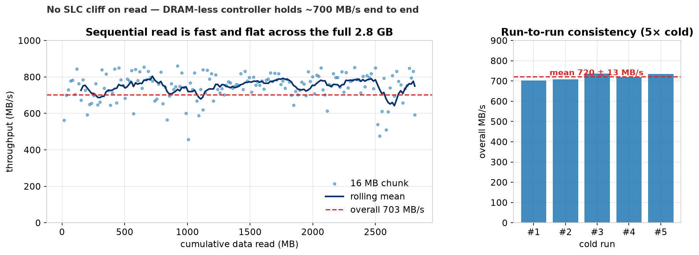
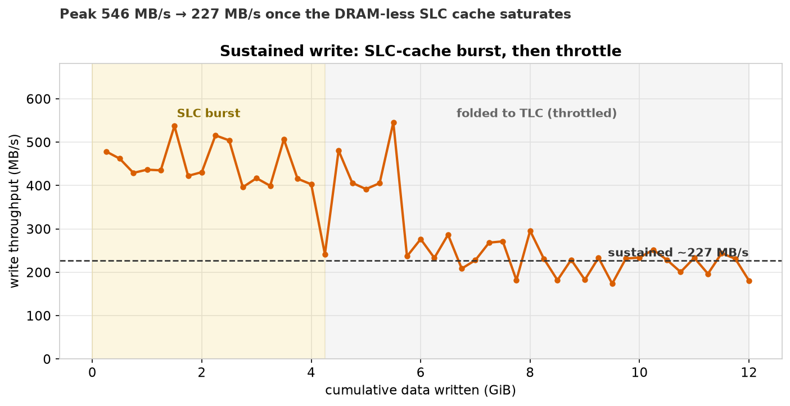
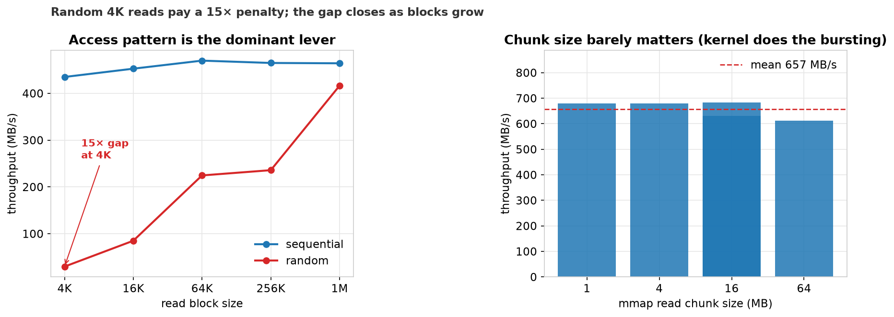
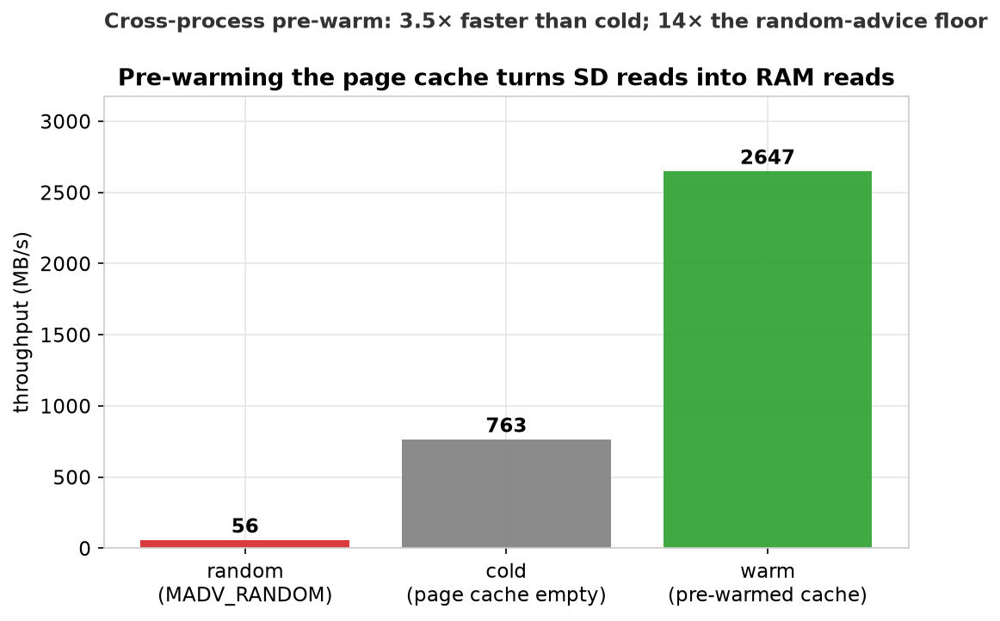
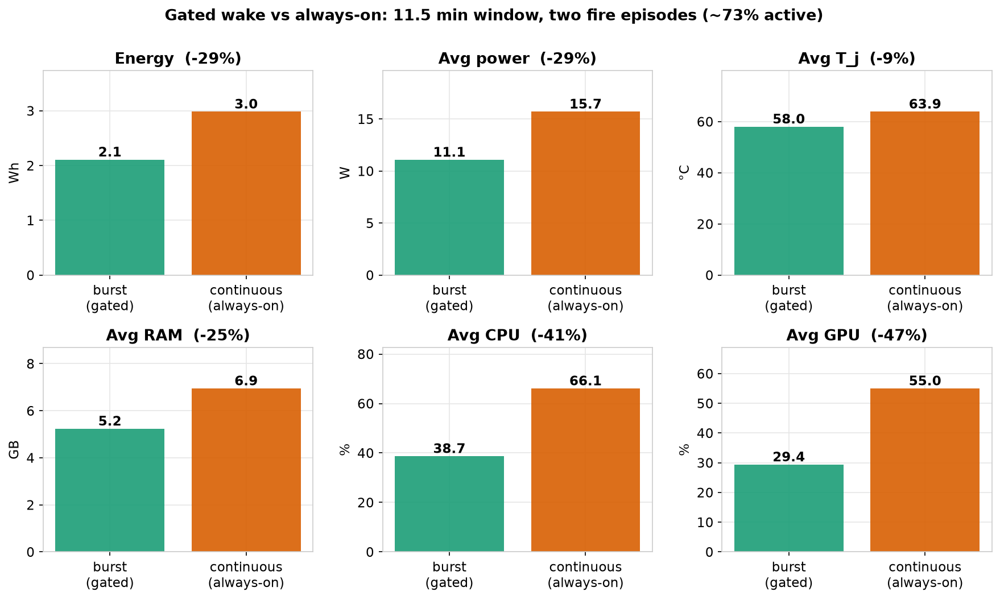
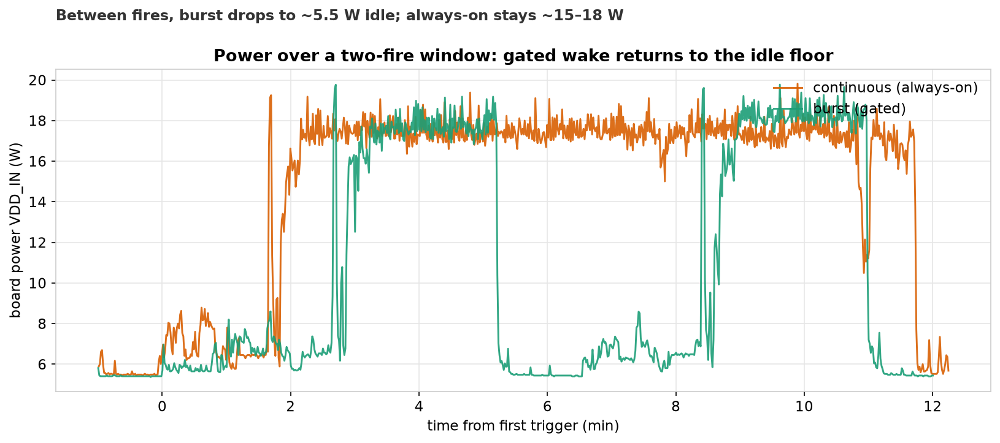
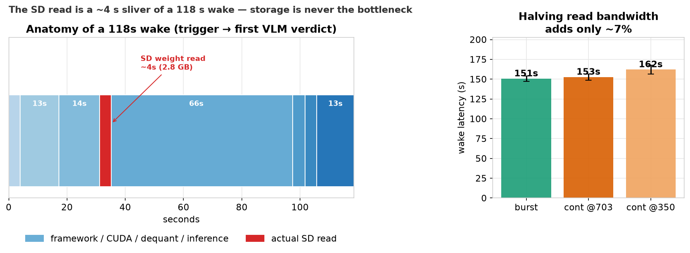

# SD Express Card — Showcase for the Wildfire-Detection Pipeline

**Thesis.** On a memory-starved edge box (Jetson Orin Nano, 7.4 GB unified), the SD Express
card is fast and consistent enough that **storage is never the bottleneck** in a demanding
VLM inference pipeline — and its low idle/burst profile lets the model *sleep on the card*
between fires, cutting system energy **29 %**. This page collects the measurements that
back both claims, newest gap-filling runs included.

All figures are generated by [`make_figures.py`](make_figures.py) from the raw JSON in
[`../results/`](../results/); the three new benchmarks are
[`bench_seq_read.py`](bench_seq_read.py), [`bench_rand_read.py`](bench_rand_read.py),
[`bench_write.py`](bench_write.py).

---

## 1. Test platform

| Property | Value |
|---|---|
| Card | WDC SanDisk **SD Express** `SDSQXFN` (SN530, **DRAM-less** controller) |
| Interface | PCIe → presented as NVMe (`nvme0n1`) in the M.2 slot |
| Capacity | 456 GB device (78 GB root partition) |
| Host | NVIDIA **Jetson Orin Nano** (Super dev kit), JetPack 7 |
| Memory | **7.4 GB unified** (CPU + GPU share one pool; no separate VRAM) |
| Workload | VILA1.5-3B-AWQ VLM + DistilBERT classifier, 2.8 GB weight set |

> The card under test *is* the root drive — benchmarking `/` benchmarks the SD.

---

## 2. Sequential read: fast and flat (no read-side SLC cliff)

A full cold read of the 2.8 GB weight set holds ~700 MB/s from first byte to last — no
burst-then-throttle on the read path — and is highly repeatable across 5 cold runs.

| Metric | Value |
|---|---|
| Overall (single trace) | 703 MB/s |
| 5× cold re-run | **720 ± 13 MB/s** (min 703, max 737) |
| Shape | flat across all 2.8 GB (DRAM-less, yet no read cliff) |

---

## 3. Sustained write: SLC burst, then throttle

Writes tell the DRAM-less story that reads hide. The first few GB land in the fast SLC
cache; once it saturates (~4 GiB here) the card folds to TLC and throughput drops sharply.
This is the one place the controller's class shows — and it matters only for large,
sustained writes, which this pipeline does not do on the hot path.

| Phase | Throughput |
|---|---|
| SLC burst (first ~4 GiB) | peak **546 MB/s** |
| Folded / sustained (TLC) | ~**180–230 MB/s** |
| Overall (12 GiB) | 282 MB/s |

---

## 4. Access pattern is the dominant lever

The biggest single factor on this card is **sequential vs random**, not block or chunk size.
Small random reads pay a large penalty that shrinks as blocks grow; sequential throughput is
essentially flat regardless of how the reader chunks it (the kernel does the read-ahead).

| Read type | 4 K | 64 K | 1 M |
|---|---|---|---|
| Sequential (MB/s) | 435 | 470 | 464 |
| Random (MB/s) | **29.7** | 225 | 416 |
| Random IOPS | 7 255 | 3 427 | 397 |

*mmap chunk-size sweep (1–64 MB): 613–680 MB/s — within noise.*
*Same-method (per-block `pread`) comparison; the 703 MB/s headline uses 16 MB streaming reads.*

---

## 5. Pre-warming turns SD reads into RAM reads

Because the page cache is cross-process, one tiny watcher can pre-warm the weights so the
*later* VLM loader reads them from RAM at ~2.6 GB/s. The flip side is the cost of getting
the access pattern wrong: forcing `MADV_RANDOM` collapses throughput to 56 MB/s with 65 k
major faults.

| Condition | Throughput |
|---|---|
| `MADV_RANDOM` (worst case) | 56 MB/s |
| Cold (page cache empty) | 763 MB/s |
| Warm (pre-warmed cache) | **2 647 MB/s** |

---

## 6. System payoff: sleep-on-SD vs always-resident

Because the card reloads the model quickly and cheaply, the VLM can sleep on it between
fires instead of staying resident. Over an 11.5-min window with two fire episodes (~73 %
active), the gated design wins on every axis, and returns to the ~5.5 W idle floor between
fires while the always-on baseline holds ~15–18 W.

| Metric | Burst (gated) | Continuous (always-on) | Δ |
|---|---|---|---|
| Energy | 2.11 Wh | 2.98 Wh | **−29 %** |
| Avg power | 11.1 W | 15.7 W | −29 % |
| Avg T_j | 58.0 °C | 63.9 °C | −9 % |
| Avg RAM | 5.2 GB | 6.9 GB | −25 % |
| Avg CPU | 38.7 % | 66.1 % | −41 % |
| Avg GPU | 29.4 % | 55.0 % | −47 % |

*Savings grow as fires get rarer.*

---

## 7. The card is never the wake bottleneck

The price of sleeping is wake latency — but that cost is **framework/CUDA-bound, not
storage-bound**. Reading all 2.8 GB of weights is a ~4 s sliver of a ~118 s wake; the
AWQ dequant + GPU init alone is 66 s. Halving the card's read bandwidth (703 → 350 MB/s)
adds only ~7 % to end-to-end latency.

| Wake phase | Seconds |
|---|---|
| docker compose up | 3.9 |
| python + imports | 13.3 |
| torch / CUDA init | 14.0 |
| **AWQ LLM load + GPU init** | **66.2** |
| startup self-benchmark | 4.2 |
| vision tower load | 4.0 |
| camera + first inference | 12.8 |
| **actual SD read (embedded)** | **~4.0** |

| Read pacing | Wake latency |
|---|---|
| Burst | 150.6 ± 3.5 s |
| Continuous @703 MB/s | 152.7 ± 4.0 s |
| Continuous @350 MB/s | 162.1 ± 5.7 s |

---

## Takeaways for the competition

1. **Fast + consistent reads** — ~700 MB/s flat across the full model, 720 ± 13 MB/s over 5 cold runs.
2. **Honest write characterization** — SLC burst 546 MB/s → ~200 MB/s sustained, exactly the DRAM-less behavior to expect.
3. **Access pattern is the lever** — 15× sequential-vs-random at 4 K; chunk size is irrelevant.
4. **Page cache is free leverage** — cross-process pre-warm → 2.6 GB/s.
5. **Enables a 29 % energy win** — the card is quick enough to sleep the whole VLM on it and reload on demand, and it never becomes the wake bottleneck.
